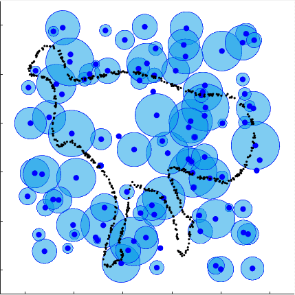

# IMAT: The Iterative Medial Axis Transform
The matlab implementation for \<IMAT: The Iterative Medial Axis Transform\> (Lee, Baek, Kim, and Park, CGF 2021).

> This paper proposes Iterative Medial Axis Transform (IMAT), an iterative descent method that constructs a medial axis transform (MAT) for a sparse, noisy, oriented point cloud sampled from an object's boundary.

- *[Paper](https://onlinelibrary.wiley.com/doi/10.1111/cgf.14266?af=R)* 

## Example
<center>
<div class="imgCollage">
<span style="width: 31.8%"></span>
</div>
  <I>Figure 1: Visualization of the optimization process of IMAT with a fixed number of balls.</I>
</center>
<br>

## Citation
If you found this library useful in your research, please consider citing:
```
@inproceedings{lee2021imat,
  title={IMAT: The Iterative Medial Axis Transform},
  author={Lee, Yonghyeon and Baek, Jonghyuk and Kim, Young Min and Park, Frank Chongwoo},
  booktitle={Computer Graphics Forum},
  volume={40},
  number={6},
  pages={162--181},
  year={2021},
  organization={Wiley Online Library}
}
```